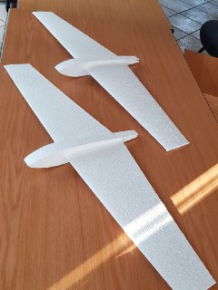
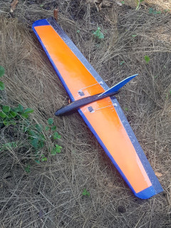
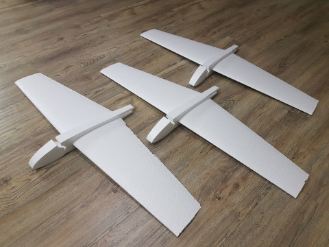
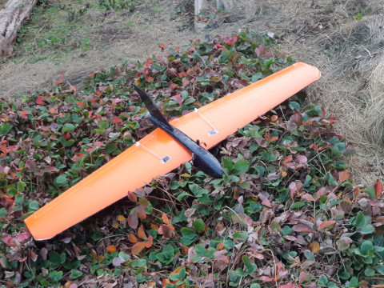
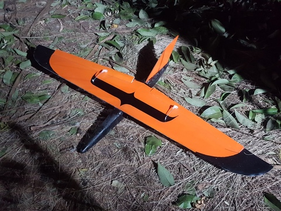
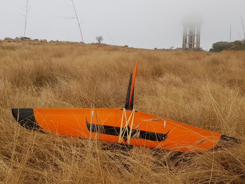
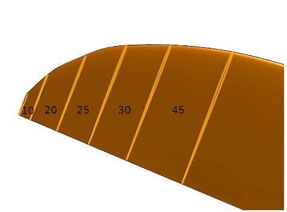
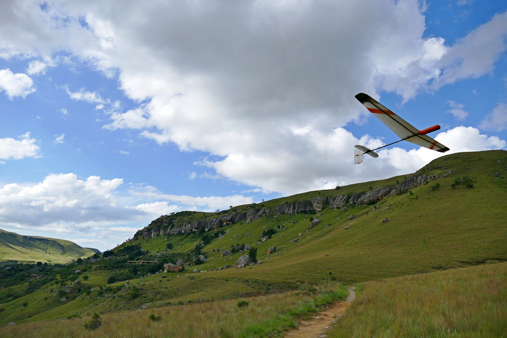

Gallery of wing and fuse designs and builts 
===

# JW 36

EPS Gcode:
* [Left Wing](img/jw36/JW36_left.gcode)
* [Right Wing](img/jw36/JW36_right.gcode)
* [Fuse Side](img/jw36/JW36_Nose%20-%20side.dxf.gcode)
* [Fuse Top](img/jw36/JW36_Nose%20-%20top.dxf.gcode)

Fuse DXF;
* [Fuse Side](img/jw36/JW36_Nose%20-%20side.dxf)
* [Fuse Top](img/jw36/JW36_Nose%20-%20top.dxf)

---

# JW 48

EPS Gcode:
* [Wing Left](img/jw48/JW48_left_1.25.gcode)
* [Wing Right](img/jw48/JW48_right_1.25.gcode)
* [Fuse Side Front](img/jw48/jw48_nose_front.dxf.gcode)
* [Fuse Side Back](img/jw48/jw48_nose_back.dxf.gcode)
* [Fuse Top Front](img/jw48/JW48_Nose%20-%20top_front.dxf.gcode)
* [Fuse Top Back](img/jw48/JW48_Nose%20-%20top_back.dxf.gcode)

Fuse DXF:
* [Fuse Side Front](img/jw48/jw48_nose_front.dxf)
* [Fuse Side Back](img/jw48/jw48_nose_back.dxf)
* [Fuse Top Front](img/jw48/JW48_Nose%20-%20top_front.dxf)
* [Fuse Top Back](img/jw48/JW48_Nose%20-%20top_back.dxf)

---

# Windburner

XPS Gcode:
* [Wing Left](img/windburner/Windburner.gcode)
* [Wing Right](img/windburner/Windburner_right.gcode)

XPS wingtips:

Ribs spacing as follows

Gcode:
* [Wing tip1](img/windburner/Windburner_tip1.gcode)
* [Wing tip2](img/windburner/Windburner_tip2.gcode)
* [Wing tip3](img/windburner/Windburner_tip3.gcode)
* [Wing tip4](img/windburner/Windburner_tip4.gcode)
* [Wing tip5](img/windburner/Windburner_tip5.gcode)

Ribs Dxf:
* [Rib1](img/windburner/windburner-rib1.dxf)
* [Rib2](img/windburner/windburner-rib2.dxf)
* [Rib3](img/windburner/windburner-rib3.dxf)
* [Rib4](img/windburner/windburner-rib4.dxf)
* [Rib5](img/windburner/windburner-rib5.dxf)
* [Rib6](img/windburner/windburner-rib6.dxf)

Fuse DXF:
      
* [Fuse Side Front](img/windburner/wb_fuse-side_front.dxf)
* [Fuse Side Back](img/windburner/wb_fuse-side_back.dxf)
* [Fuse Top Front](img/windburner/wb_fuse-top_front.dxf)
* [Fuse Top Back](img/windburner/wb_fuse-top_back.dxf)

---
# KB1 rip-off

XPS Gcode:

* [Left Wing](img/kb1/kb1.gcode)
* [Right Wing](img/kb1/kb1_left.gcode)

Fuse:
* [Nose](img/kb1/nose.gcode)
* [Tail](img/kb1/tail.gcode)
* [Mid](img/kb1/kb_fuse_front_slot_cut.svg.gcode)
* [Side](img/kb1/kb_fuse_side.svg.gcode)

---
# DLG Apogee by Mark Drella - fibreglass version by A Filos 

Build Videos:
https://www.rcgroups.com/forums/showthread.php?3837071-1m-DLG-Build

Gcode:
* [Left wing](img/filos_apogee/dlg_left.gcode)
* [Right wing](img/filos_apogee/dlg_right.gcode)
* [Wing plan](img/filos_apogee/filos-dlg-Bodywingplan.svg)
* [Horizontal stab](img/filos_apogee/filos-dlg-tailhorizontal.svg)
* [Vertical stab](img/filos_apogee/filos-dlg-tailrudder.svg)

---
# What will you build next?

You can add content here by commiting changes to https://github.com/skullkey/hotwing-dash-contrib  

* `gallery.md` is this file
* `img/`  folder for static content 
